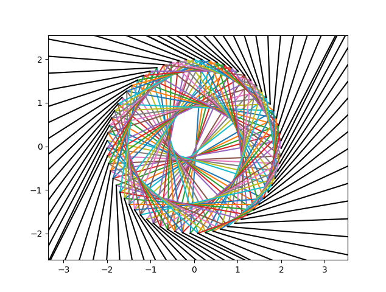
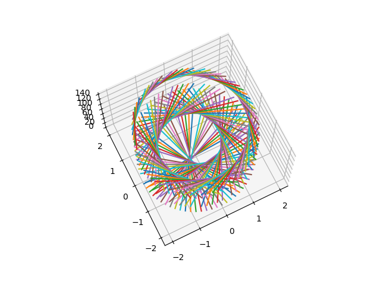

# Circular Geometric String Art

This Python script generates a circular geometric string art pattern using matplotlib. It creates an intricate design by connecting points along a circle with strings. The pattern can be displayed in 2D or 3D.

## Prerequisites

- Python 3.x
- NumPy
- Matplotlib

## Usage

1. Clone the repository or download the script file: `circular_string_art.py`

2. Open a terminal or command prompt and navigate to the directory containing the script.

3. Run the script using the following command:

   `python circular_string_art.py [r] [noPins] [n] [threeD]`

## Optional Arguments
- `r`: Radius of the circle. Default is 2.
- `noPins`: Number of pins along the circle. Default is 72.
- `n`: Length factor determining the chords. Default is 2.
- `threeD`: Specify "True" to display the pattern in 3D. Default is False (2D).

## Usage
1. Clone the repository or download the script file: `circular_string_art.py`

2. Open a terminal or command prompt and navigate to the directory containing the script.

3. Run the script using the following command:
'python circular_string_art.py 2.5 96 3 True'

4. The string art pattern will be displayed in a new window.
5. Close the window to exit the program.

## Examples

*2D String Art Example*

*3D String Art Example*